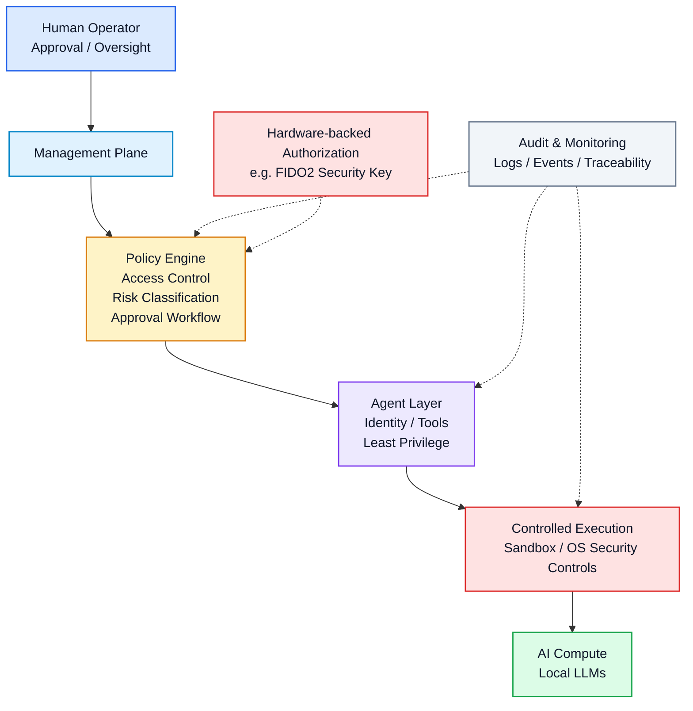

# Lab2: AI Governance Lab — Current vs. Target Architecture
Purpose
This lab explores the governance and security of locally deployed AI agents, with a focus on least privilege, human oversight, access control, network isolation, auditability, and controlled agent autonomy.
The current implementation is deliberately simple and cost-efficient. The target architecture represents a theoretical, more mature governance model rather than a planned home infrastructure.

Current Architecture
The real setup is intentionally compact: a laptop acts as the management console, while a dedicated local compute node runs the AI workloads without a permanent local display or keyboard.

The direct Ethernet link creates a small, private management path without requiring the AI node to be directly exposed to the wider network.

Target Architecture
A more mature design introduces explicit governance and security control layers between the agent and the underlying system.

Governance Principles
Least privilege: agents receive only the permissions required for their tasks.
Separation of duties: requesting an action and authorizing a high-risk action are distinct functions.
Human-in-the-loop: sensitive or irreversible actions require explicit human approval.
Policy enforcement: agents interact with controlled tools rather than directly with the operating system.
Defence in depth: operating-system controls, sandboxing, network controls and identity controls provide independent safeguards.
Auditability: agent requests, tool calls, approvals and outcomes should be logged for traceability.
Hardware-backed authorization: highly sensitive operations may require a physical cryptographic authenticator.

The objective is not to eliminate agent autonomy, but to make this autonomy bounded, observable, attributable and reversible where possible.
